# InfoLoop: Escape the Algorithm
## 🎮 PLAY THE GAME ONLINE

👉 **[CLICK HERE TO PLAY InfoLoop: Escape the Algorithm](https://marijagj4.github.io/InfoLoop-Escape-The-Algorithm/)**

---

## Идеја и мотив позади играта

**InfoLoop: Escape the Algorithm** е 2D едукативна игра изработена на тема медиумска писменост и дигитална култура. Мотивот зад играта е да се прикаже како корисниците можат да бидат заробени во алгоритамски feed преку clickbait, fake news, непроверени извори, пристрасни информации, AI fake images и echo chambers.

Играта има за цел да го поттикне играчот да размислува критички, да проверува извори, да анализира информации и да не споделува содржина без претходна проверка.

---

## Идеја во една реченица

**InfoLoop: Escape the Algorithm** е 2D игра во која играчот собира проверени информации, избегнува медиумски замки и одговара на quiz прашања за да избега од AI-powered algorithm.

**Hashtags:**
#InfoLoop #EscapeTheAlgorithm #MediaLiteracy

---

## Мисија на играта

Мисијата на играта е играчот да достигне **300 Score**, да избегне **Algorithm Trap** и успешно да ги помине трите quiz предизвици.

Преку играта, играчот учи да препознава проверени извори, да анализира biased content и да евалуира AI-generated или манипулирана содржина пред да ја сподели.

---

## Приказната на играта

Играчот е заробен во AI-powered feed наречен **InfoLoop**. Алгоритмот постојано прикажува содржини кои изгледаат привлечни, но не секогаш се точни или проверени.

Во feed-от се појавуваат добри медиумски навики како:

* Verified Source
* Fact Check
* Date Checked
* Compare Sources
* Critical Thinking
* Think Before Sharing

Истовремено, играчот мора да избегнува медиумски замки како:

* Clickbait Trap
* Fake News
* No Date
* Emotional Manipulation
* Sponsored Content
* AI Fake Image
* Echo Chamber
* Fake Expert

Како што играта напредува, алгоритмот станува побрз и поопасен. Играчот мора да покаже дека знае да пристапи до информација, да ја анализира, да ја евалуира и одговорно да ја сподели.

---

## Gameplay

Играта е **2D falling cards game**. Играчот се движи низ екранот и собира картички кои паѓаат од горниот дел на сцената.

* Зелените картички претставуваат добри медиумски навики и носат Score.
* Лошите картички претставуваат медиумски замки и го зголемуваат Algorithm Trap или Bias Meter.
* После одреден број поени се отвора quiz challenge.
* Точен одговор носи bonus score и намалување на Algorithm Trap.
* Погрешен одговор го зголемува Algorithm Trap.

Играта содржи:

* Player movement
* Falling cards
* Score system
* Algorithm Trap system
* Bias Meter
* Three levels
* Quiz challenges
* Win/Lose ending
* Restart button
* Sound effects
* Background music
* Quiz music

---

## Levels

### Level 1: Clickbait Feed

Во првото ниво играчот учи да препознае основни сигнали на проверени и непроверени информации.

**Collect:**

* Verified Source
* Fact Check
* Date Checked

**Avoid:**

* Clickbait Trap
* Fake News
* No Date

Целта е да се достигне **100 Score** за да се отвори првиот quiz challenge.

---

### Level 2: Bias Bubble

Во второто ниво се додава нова механика: **Bias Meter**.

Одредени лоши картички не го зголемуваат Algorithm Trap директно, туку го зголемуваат Bias Meter. Кога Bias ќе стигне **3/3**, Algorithm Trap се зголемува за 1.

**Watch out for:**

* Emotional Manipulation
* One-sided Story
* Sponsored Content

**Collect:**

* Author Found
* Compare Sources
* Analyze Message
* Double Check

Целта е да се достигне **200 Score** за да се отвори вториот quiz challenge.

---

### Level 3: AI Algorithm Storm

Третото ниво е најтешко. Feed-от станува побрз и се појавуваат посериозни дигитални ризици.

**Watch out for:**

* AI Fake Image
* Echo Chamber
* Fake Expert
* Manipulated Screenshot
* Power Influence

**Collect:**

* Critical Thinking
* Evaluate Info
* Think Before Sharing
* Reliable Evidence

**AI Fake Image** носи **+2 Algorithm Trap**, бидејќи AI-generated или манипулирани слики можат да изгледаат реално и да бидат опасни ако се споделат без проверка.

Целта е да се достигне **300 Score** и да се заврши final quiz challenge.

---

## Quiz Challenges

После секој level, играчот добива quiz card. Прашањата се поврзани со медиумска писменост.

Quiz предизвиците се фокусираат на:

* препознавање clickbait
* проверка на извор, автор и датум
* евалуација на AI-generated image пред споделување

Quiz cards ја поврзуваат играта со главните чекори на медиумска писменост: пристапување до информација, анализа, евалуација и одговорно споделување.

---

## Како играта завршува

Играта има два можни краја.

### Win

Играчот успешно избега од алгоритмот бидејќи анализирал, евалуирал и одговорно ги користел информациите.

### Lose

Играчот е заробен од алгоритмот поради премногу clickbait, fake news, bias и непроверени информации.

---

## Околина за развој

Играта е развиена во **Unity 6** како 2D game project. За логиката се користи **C#**, а за интерфејсот се користат **Unity UI** и **TextMeshPro**.

Користени Unity елементи:

* 2D Colliders
* Rigidbody2D
* Prefabs
* Canvas UI
* TextMeshPro
* Buttons
* AudioSource

Користени scripts:

* GameManager
* PlayerMovement
* ItemSpawner
* GoodItemCollect
* BadItemCollect
* FallingItem
* CardLabel
* QuizManager
* SoundManager

Звуците, sound effects, background music и quiz music се генерирани преку C# код во **SoundManager**, без користење надворешни audio assets.

---

## Како се игра

1. Играчот кликнува **Start Game**.
2. Се прикажува објаснување за Level 1.
3. Играчот собира добри картички и избегнува лоши.
4. На 100 Score се отвора првиот quiz.
5. После quiz-от се оди на Level 2.
6. На 200 Score се отвора вториот quiz.
7. После тоа се оди на Level 3.
8. На 300 Score се отвора final quiz.
9. Ако играчот успешно одговори и Algorithm Trap не стигне 5, победува.
10. Ако Algorithm Trap стигне 5, алгоритмот го заробува играчот.

---

## Screenshots

### Start Screen

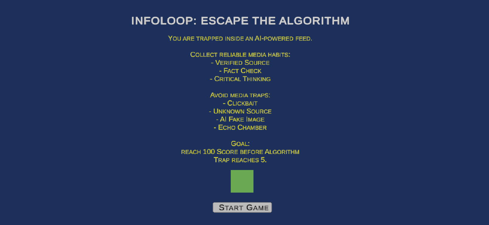

### Level 1 Info

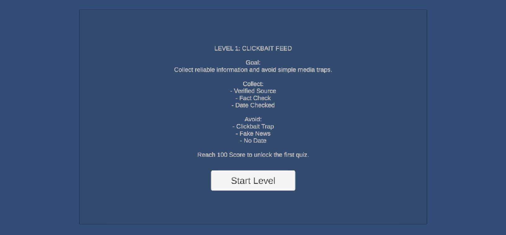

### Gameplay - Level 1

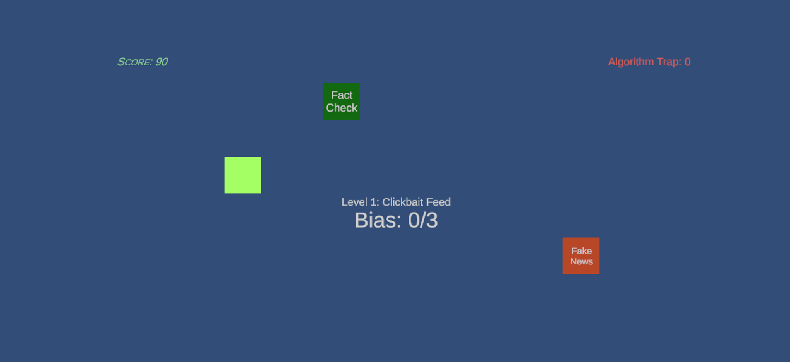

### Quiz - Level 1

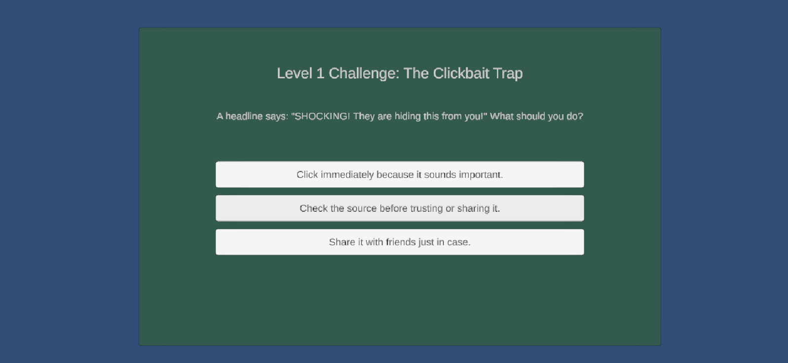

### Level 2 Info

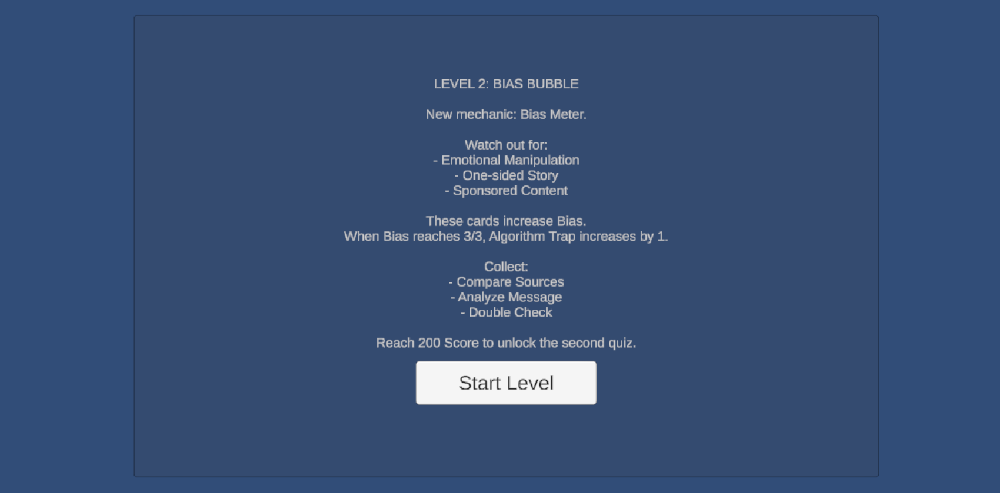

### Gameplay - Level 2

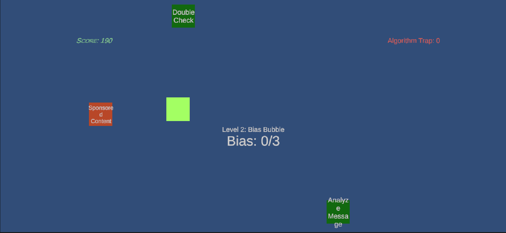

### Quiz - Level 2

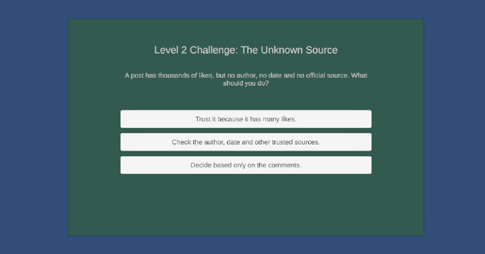

### Level 3 Info

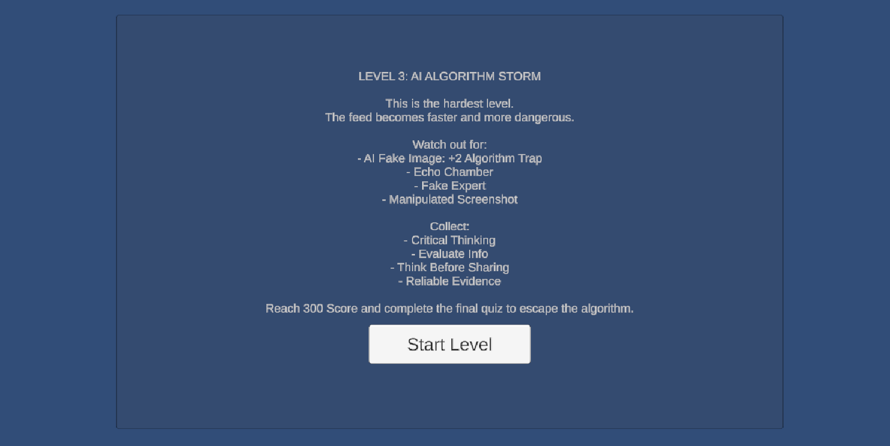

### Gameplay - Level 3

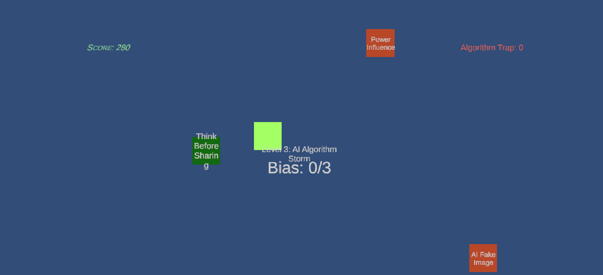

### Final Quiz

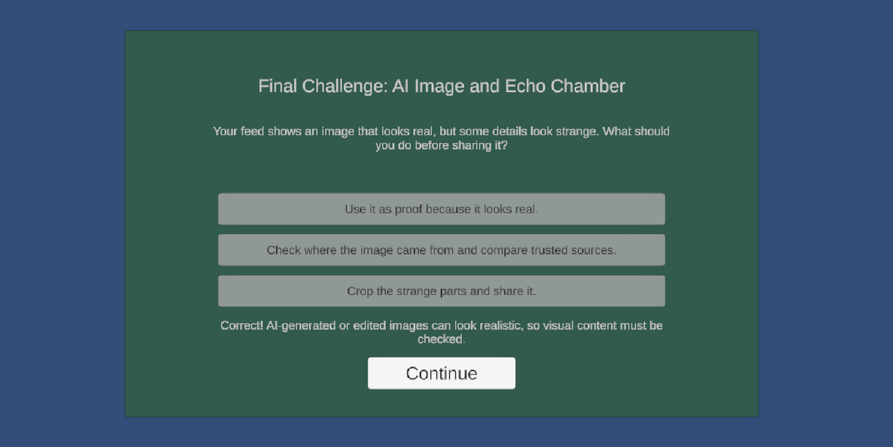

### Win Screen

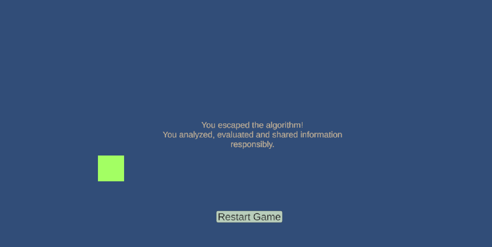

### Lose Screen

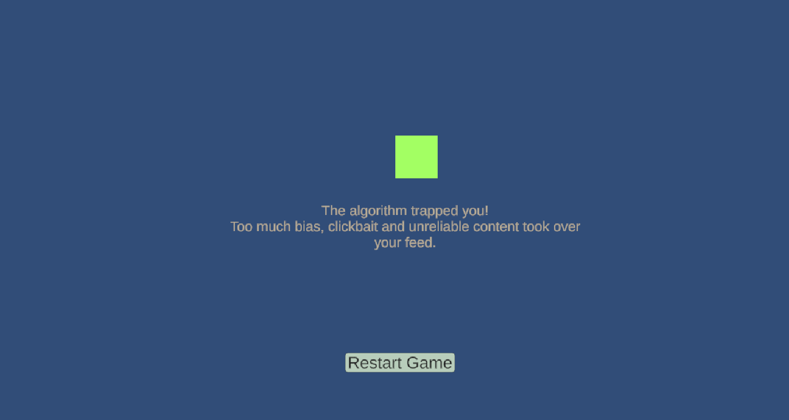

---

## Користени ресурси

* Unity 6
* C#
* TextMeshPro
* Unity UI
* 2D Colliders
* Rigidbody2D
* AudioSource
* Custom generated sound effects
* Custom generated background music
* Custom generated quiz music

---

## Заклучок

**InfoLoop: Escape the Algorithm** е едукативна игра која ја поврзува медиумската писменост со интерактивен gameplay. Преку собирање картички, избегнување медиумски замки, Bias Meter и quiz предизвици, играчот учи како да препознава, анализира и евалуира информации во дигитална средина.
